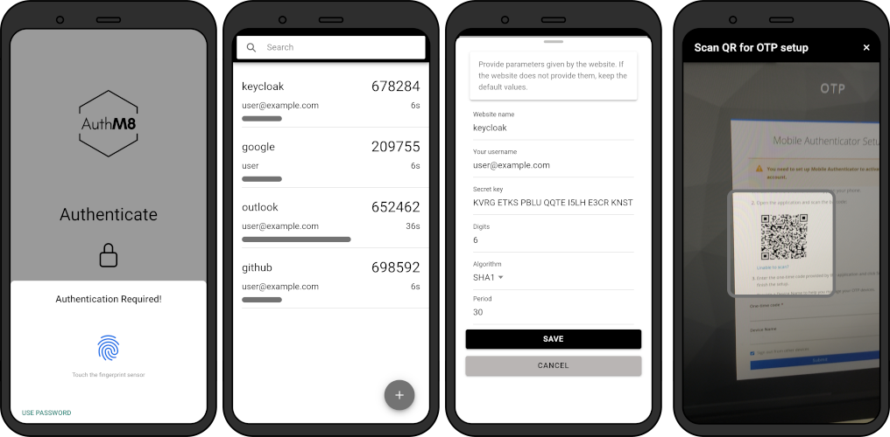
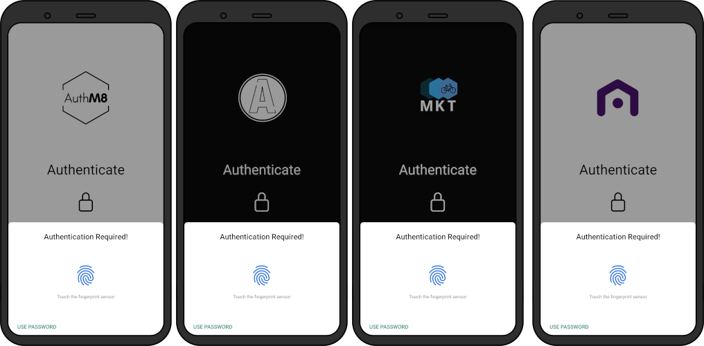

# AuthM8
Free mobile authenticator

# About
**AuthM8** app is a cross-platform solution for two-factor authentication (2FA) using TOTP (Time-based One-Time Password). The app is compatible with both Android and iOS devices and is designed to provide a customizable, secure authentication tool.

<p align="center">
  
</p>



# Key Features
  1. **User-Friendly Setup**: The app is designed for straightforward implementation. Companies can fork the repository from GitHub and follow simple instructions to configure their version of the app, requiring only basic modifications to a few configuration files.
  2. **Cross-Platform Support**: The app works on both Android and iOS devices, ensuring broad accessibility for users.
  3. **Open-Source Foundation**: The AuthM8 is built on an open-source platform, allowing for community contributions and feedback. This open approach encourages collaboration and continuous improvement.
  4. **Security and Flexibility**: For users with more advanced technical needs, the app allows for deeper customization, including modifications to CSS, HTML, and app behavior.
  5. **Streamlined Deployment**: The app is designed to simplify the process of releasing it on platforms such as Google Play. Pre-filled templates for data security forms and other requirements may be made available to reduce the complexity of the submission process.
  6. **Customizability**: The app allows for the easy modification of branding elements: logos and color schemes. This enables organizations to maintain a consistent brand identity while providing a secure authentication experience.




# Running
Build:
```bash
ionic capacitor build <platform>
```
Debug:
```bash
ionic capacitor run <platform> --livereload --external
```
Prod:
```bash
ionic capacitor run <platform>
```

# Customization
There are theme examples in `src/assets/`. To test them, add `--configuration <theme directory name>` to your build/run command.

Customizing the app:
* Text
  * Modify `src/app/constants/texts.ts`.
* Theme
  * Create a new directory `src/<theme name>`.
  * Create `src/<theme name>/variables.scss` and `src/<theme name>/logo.png`.
    * You can use a [generator](https://ionicframework.com/docs/theming/color-generator).
  * You can add your custom global CSS styles to the `.scss` file 
  * Add a new configuration in `angular.json`.
    * Add new entries in `projects.app.architect.serve.configurations` and `projects.app.architect.build.configurations`.
* App name and App ID
  * Use the VS Code Ionic extension to change app name and id. Enter the Ionic extension menu in the sidebar and edit `Configuration` > `Properties`.
  * Alternatively, you can manually edit the following files:
    * `capacitor.config.ts` and `ionic.config.json`
    * `package.json` and `package-lock.json` ("name" fields)
    * `android/app/src/main/res/values/strings.xml`
    * `ios/App/App/Info.plist` (CFBundleDisplayName)
    * `android/app/build.gradle` (namespace and applicationId)
    * `ios/App/App.xcodeproj` (PRODUCT_BUNDLE_IDENTIFIER)
    * `andorid/app/src/main/java/io/ionic/starter/MainActivity.java` (package)
* Icon and Splash Screen
  * Replace files in `assets/` (not in `src/assets`!)
  * The dimensions of the images should not be changed.
  * Run `npx @capacitor/assets generate`.


[](https://youtu.be/ghb3JjF_tYk)
